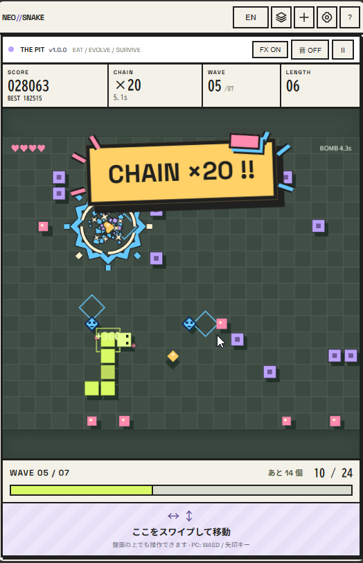

# ネオスネーク / NEO//SNAKE

エサを食べて伸びた体が、そのまま弾になるスネークゲーム。敵や障害物を撃ち壊し、強化を選びながらスコアを伸ばしていきます。長くなりすぎないように立ち回って、ハイスコアを目指しましょう。

PCでもスマホでも遊べます。日本語・英語に対応しています。

**[▶ ブラウザで遊ぶ](https://akeit0.github.io/neo-snake/)**



見た目はネオブルータリズムをヒントに、くっきりした色と輪郭でまとめています。

## 起動

Node.js 22以上を使います。追加パッケージや `npm install` は不要です。

```sh
npm run build
python -m http.server 8080 --directory dist
```

[http://localhost:8080](http://localhost:8080) を開いて遊べます。開発版の起動・数値調整・演出プレビュー・GitHub Pagesへの公開は[開発と公開](docs/development.md)を参照してください。配信するのは `dist/` の内容だけです。

## ドキュメント

| 資料 | 内容 |
| --- | --- |
| [遊び方と設定](docs/gameplay.md) | 操作、ルール、スコア・チップ、言語・音、保存とリセット |
| [ラン内強化と永久強化](docs/upgrades.md) | 効果、レベル上限、価格、爆弾・テール・カッターの動作 |
| [バランス基準](docs/balance.md) | ウェーブの増加式と上限、配置、長さの調整目標 |
| [開発と公開](docs/development.md) | ビルド、GitHub Pages、JSON入出力、演出プレビュー、構成と検証 |
| [デザイン方針](docs/design.md) | ネオブルータリズムのテーマ、色、UI・FXの基準、参考資料 |

## Language

English and Japanese are supported. See [language settings](docs/gameplay.md#言語--language).

## ライセンス

このプロジェクトのソースコード、ドキュメント、独自SVGアイコン、合成BGMを **CC0 1.0 Universal** で提供します。全文は [LICENSE](LICENSE)、公式の内容は [Creative Commons CC0](https://creativecommons.org/publicdomain/zero/1.0/) を参照してください。公開用・開発用の出力にも同じLICENSEを含め、ヘルプから確認できます。

外部配信のGoogle FontsはCC0の対象外で、各フォントのSIL Open Font Licenseに従います： [Noto Sans JP](https://github.com/google/fonts/blob/main/ofl/notosansjp/OFL.txt)、[Space Grotesk](https://github.com/google/fonts/blob/main/ofl/spacegrotesk/OFL.txt)。フォントファイルはこのリポジトリや公開用出力に含めていません。
